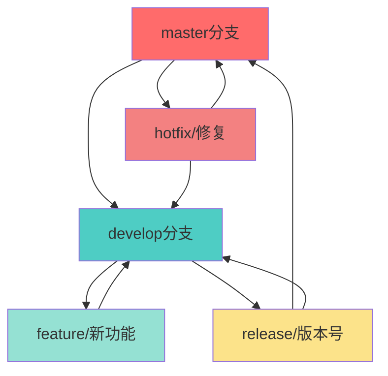

# Git Flow工作流程详解

## 概述

Git Flow 是一种基于 Git 的分支管理模型，通过定义严格的分支模型，为软件开发提供了清晰的工作流程，特别适合有固定发布周期的项目。

## 核心分支

| 类型 | 分支名称 | 说明 |
|------|---------|------|
| **主要分支** | master | 生产环境，存储正式发布的版本代码 |
| | develop | 开发环境，最新的开发版本，包含下个版本的功能 |
| **辅助分支** | feature | 新功能，从 develop 创建，完成后合并回 develop |
| | release | 版本发布，从 develop 创建，完成后合并到 master 和 develop |
| | hotfix | 紧急修复，从 master 创建，修复后合并到 master 和 develop |

## 工作流程图



## 安装和初始化

### 安装 Git Flow

```bash
# macOS
brew install git-flow

# Ubuntu/Debian
apt-get install git-flow

# Windows: 下载并安装 https://github.com/nvie/gitflow
```

### 初始化

```bash
# 在项目根目录执行，按提示配置分支命名规范
git flow init

# 初始化会询问以下配置（通常使用默认值即可）：
# - 生产分支: master
# - 开发分支: develop
# - 功能分支前缀: feature/
# - 发布分支前缀: release/
# - 热修复分支前缀: hotfix/
# - 版本标签前缀: v（可选）
```

## 功能开发（Feature）

**1. 创建功能分支**

```bash
git flow feature start user-login
```

**2. 开发并提交**

```bash
git add .
git commit -m "feat: 实现用户登录功能"
git push origin feature/user-login  # 可选
```

**3. 完成功能开发**

```bash
git flow feature finish user-login
git push origin develop  # ⚠️ 需要手动推送
```

## 发布版本（Release）

**1. 创建发布分支**

```bash
git flow release start 1.0.0
```

**2. 发布准备工作**

在 release 分支上更新版本号、文档，修复小的 bug（只允许 bug 修复，不允许新功能）：

```bash
git commit -m "chore: 更新版本号到 1.0.0"
git commit -m "fix: 修复发布前的小问题"
```

**3. 完成发布**

```bash
git flow release finish '1.0.0'
git push origin master      # ⚠️ 需要手动推送
git push origin develop
git push --tags
```

## 修复问题（Hotfix）

**1. 创建热修复分支**

从 master 分支创建（用于紧急修复线上问题）：

```bash
git flow hotfix start fix-login-bug
```

**2. 修复问题并提交**

```bash
git commit -m "fix: 修复登录验证bug"
```

**3. 完成热修复**

```bash
git flow hotfix finish fix-login-bug
git push origin master      # ⚠️ 需要手动推送
git push origin develop
git push --tags
```

## 完整工作流示例

**场景：开发新功能并发布**

```bash
# 1. 开发新功能
git flow feature start user-login
git add .
git commit -m "feat: 实现用户登录功能"
git push origin feature/user-login
git flow feature finish user-login
git push origin develop

# 2. 准备发布
git flow release start 1.0.0
git commit -m "chore: 更新版本号到 1.0.0"
git flow release finish '1.0.0'
git push origin master
git push origin develop
git push --tags

# 3. 如果发现线上问题，创建热修复
git flow hotfix start fix-login-bug
git commit -m "fix: 修复登录bug"
git flow hotfix finish fix-login-bug
git push origin master
git push origin develop
git push --tags
```

## 高级场景

### 多版本并行开发

```bash
# 场景：从 release 分支切出来的 feature 分支需要特殊处理

# 定期从 release 分支合并更新
git checkout feature/1.4.0
git merge release/1.3.0

# release 完成后，需要同步 develop 的更新
git checkout feature/1.4.0
git merge develop
```

### 使用 Rebase 保持历史整洁

```bash
# 更新 develop 到最新
git checkout develop
git pull

# 切换到 feature 分支并 rebase（保持提交历史线性）
git checkout feature/v1.0.0
git rebase develop
```

## 分支策略说明

### <span style="color: #ef4444; font-weight: 600;">master</span> 分支
- **作用**：存储正式发布的版本代码
- **规则**：只能通过 <span style="color: #f59e0b; font-weight: 600;">release</span> 和 <span style="color: #ec4899; font-weight: 600;">hotfix</span> 合并，每次合并都会打上版本标签

### <span style="color: #06b6d4; font-weight: 600;">develop</span> 分支
- **作用**：最新的开发版本，包含下个版本的功能
- **规则**：所有新功能都合并到这里，用于集成测试

### <span style="color: #8b5cf6; font-weight: 600;">feature</span> 分支
- **作用**：开发新功能
- **规则**：从 <span style="color: #06b6d4; font-weight: 600;">develop</span> 创建，完成后合并回 <span style="color: #06b6d4; font-weight: 600;">develop</span>，可以同时存在多个

### <span style="color: #f59e0b; font-weight: 600;">release</span> 分支
- **作用**：版本发布准备
- **规则**：从 <span style="color: #06b6d4; font-weight: 600;">develop</span> 创建，只允许 bug 修复，完成后合并到 <span style="color: #ef4444; font-weight: 600;">master</span> 和 <span style="color: #06b6d4; font-weight: 600;">develop</span>

### <span style="color: #ec4899; font-weight: 600;">hotfix</span> 分支
- **作用**：修复线上问题
- **规则**：从 <span style="color: #ef4444; font-weight: 600;">master</span> 创建，修复后合并到 <span style="color: #ef4444; font-weight: 600;">master</span> 和 <span style="color: #06b6d4; font-weight: 600;">develop</span>

## 最佳实践

### 1. 分支命名规范
- feature/功能名称（如 feature/user-login）
- release/版本号（如 release/1.0.0）
- hotfix/修复描述（如 hotfix/login-bug）

### 2. 版本号规范
遵循语义化版本规范（Semantic Versioning）：
- **主版本号.次版本号.修订号**（如 1.0.0）
- **主版本号**：不兼容的 API 修改
- **次版本号**：向下兼容的功能性新增
- **修订号**：向下兼容的问题修正

### 3. 关键注意事项
- ✅ 始终保持 <span style="color: #ef4444; font-weight: 600;">master</span> 分支稳定，只包含已发布的代码
- ✅ 所有开发工作都在 <span style="color: #06b6d4; font-weight: 600;">develop</span> 分支或特性分支中进行
- ✅ 在执行 finish 操作前，确保分支上的工作已完全完成
- ✅ 每次 finish 操作后，记得及时推送相关分支和标签到远程

## 总结

Git Flow 提供了一套清晰的分支管理策略，通过严格的分支模型和明确的工作流程，能够有效管理项目的版本发布和功能开发。掌握 Git Flow 的使用方法，能够提高团队协作效率和代码质量。

## 参考资料

- [Git Flow 官方文档](https://github.com/nvie/gitflow)
- [语义化版本规范](https://semver.org/lang/zh-CN/)
- [约定式提交规范](https://www.conventionalcommits.org/zh-hans/)
