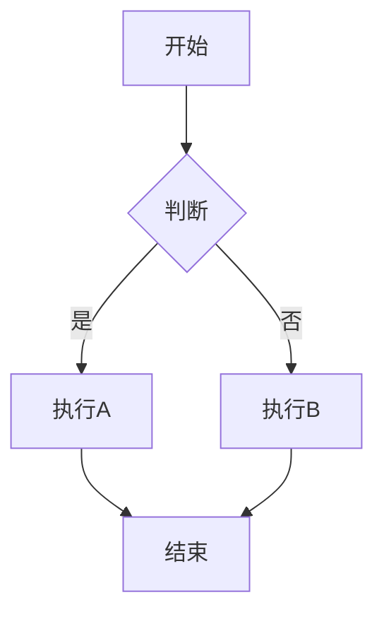

# Mermaid 流程图部署说明

## 概述

本博客已集成 Mermaid 流程图支持，可以在 Markdown 文章中直接使用 Mermaid 语法绘制流程图、时序图等。

## 部署兼容性

✅ **完全兼容以下部署平台：**

- **Vercel** - 完全支持，无需额外配置
- **Netlify** - 完全支持，无需额外配置
- **GitHub Pages** - 需要静态导出（`output: 'export'`）
- **自建服务器** - 完全支持
- **Docker 容器** - 完全支持

## 技术实现

### 1. 客户端渲染

Mermaid 图表在客户端（浏览器）渲染，不依赖服务端：

- ✅ 使用 `'use client'` 标记为客户端组件
- ✅ 使用动态导入 `import('mermaid')` 实现代码分割
- ✅ 在 `useEffect` 中初始化，避免 SSR 问题

### 2. 静态生成（SSG）

文章页面使用 Next.js 的静态生成：

- ✅ 使用 `generateStaticParams` 预生成所有文章页面
- ✅ 构建时不会执行 Mermaid 渲染（客户端渲染）
- ✅ 部署后首次访问时在浏览器中渲染图表

## 部署步骤

### Vercel 部署

1. 确保 `package.json` 包含依赖：
   ```json
   {
     "dependencies": {
       "mermaid": "^10.9.5",
       "react-markdown": "^9.1.0"
     }
   }
   ```

2. 推送代码到 Git 仓库

3. 在 Vercel 中导入项目

4. 构建和部署会自动完成

### Netlify 部署

1. 创建 `netlify.toml`（可选）：
   ```toml
   [build]
     command = "npm run build"
     publish = ".next"
   ```

2. 在 Netlify 中连接 Git 仓库

3. 构建和部署会自动完成

### 静态导出（GitHub Pages 等）

如果需要静态导出，修改 `next.config.js`：

```javascript
const nextConfig = {
  output: 'export',  // 启用静态导出
  // ... 其他配置
}
```

然后构建：
```bash
npm run build
```

导出的文件在 `out` 目录，可以部署到任何静态托管服务。

## 使用示例

在 Markdown 文章中使用 Mermaid：

````markdown

````

## 故障排查

### 图表不显示

1. **检查浏览器控制台**：查看是否有 JavaScript 错误
2. **检查网络请求**：确保 mermaid 包已正确加载
3. **检查代码格式**：确保 Mermaid 代码块格式正确

### 构建错误

如果构建时出现 mermaid 相关错误：

1. 确保 `next.config.js` 中已配置 webpack externals（已包含）
2. 确保 `mermaid` 在 `dependencies` 中，不在 `devDependencies` 中

### 性能优化

- Mermaid 使用动态导入，只在需要时加载
- 图表在客户端渲染，不影响首屏加载速度
- 每个图表独立渲染，互不影响

## 注意事项

1. **首次加载**：Mermaid 库会在首次渲染图表时加载，可能需要几秒钟
2. **浏览器兼容性**：需要现代浏览器支持（Chrome、Firefox、Safari、Edge）
3. **图表大小**：复杂图表可能需要更多渲染时间

## 测试部署

部署后，访问包含 Mermaid 图表的文章页面：

1. 打开浏览器开发者工具（F12）
2. 查看 Network 标签，确认 mermaid 包已加载
3. 查看 Console 标签，确认没有错误
4. 图表应该正常显示

## 支持的功能

- ✅ 流程图（Flowchart）
- ✅ 时序图（Sequence Diagram）
- ✅ 甘特图（Gantt Chart）
- ✅ 类图（Class Diagram）
- ✅ 状态图（State Diagram）
- ✅ 饼图（Pie Chart）
- ✅ 更多 Mermaid 支持的图表类型

## 参考资源

- [Mermaid 官方文档](https://mermaid.js.org/)
- [Next.js 部署文档](https://nextjs.org/docs/deployment)
- [react-markdown 文档](https://github.com/remarkjs/react-markdown)
